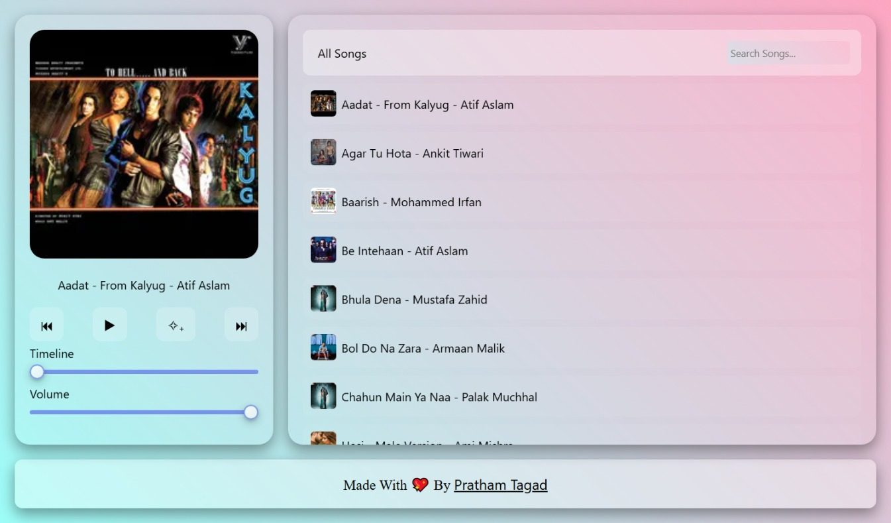
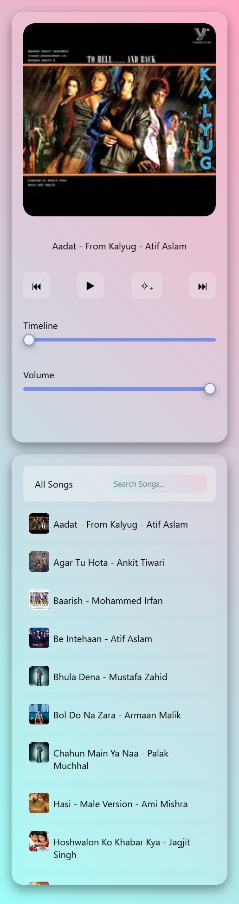

# 🎵 Web Music Player

A sleek JavaScript music player with **smart shuffle**, **search**, and **dynamic audio controls** — built with HTML, CSS, and JS.

---

## ✨ Features

- 🎧 Auto song list from `assets/audio/`
- 🖼️ Dynamic thumbnails from `assets/thumbnails/`
- ▶️ Play / Pause / Next / Previous buttons
- 🔀 **Smart Shuffle** (no repeats until all songs played)
- 🔊 Volume control + Seekable timeline
- 🔍 Real-time search filtering
- 🎨 Responsive UI with smooth gradients

---

## 📂 Project Structure
```
project-folder/
│
├── index.html
├── style.css
├── script.js
├── assets/
│ ├── audio/ # All .mp3 songs
│ └── thumbnails/ # Matching .jpg thumbnails
```

---

## 🛠️ How to Use

1. Clone or download the repo  
2. Place your `.mp3` songs in `assets/audio/`  
3. Add matching `.jpg` thumbnails in `assets/thumbnails/`  
   (Make sure the names match the song files exactly)  
4. Open `index.html` in your browser  
5. 🎶 Enjoy your custom web music player!

---

## 🧠 Tech Stack

- HTML5  
- CSS3  
- JavaScript (Vanilla)

---

## 📸 Preview

  
  

---

## 💖 Credits

Made with passion by [Pratham Tagad](https://github.com/prathamtagad)

---

## 📄 License

This project is open-source and free to use under the [MIT License](LICENSE).
